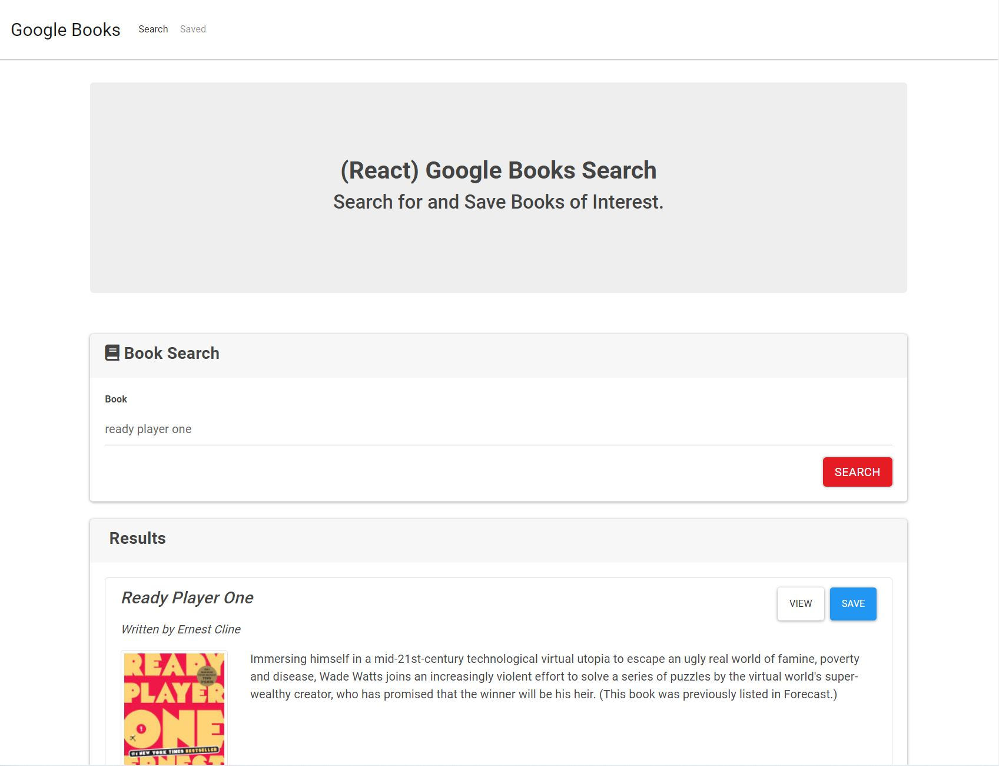
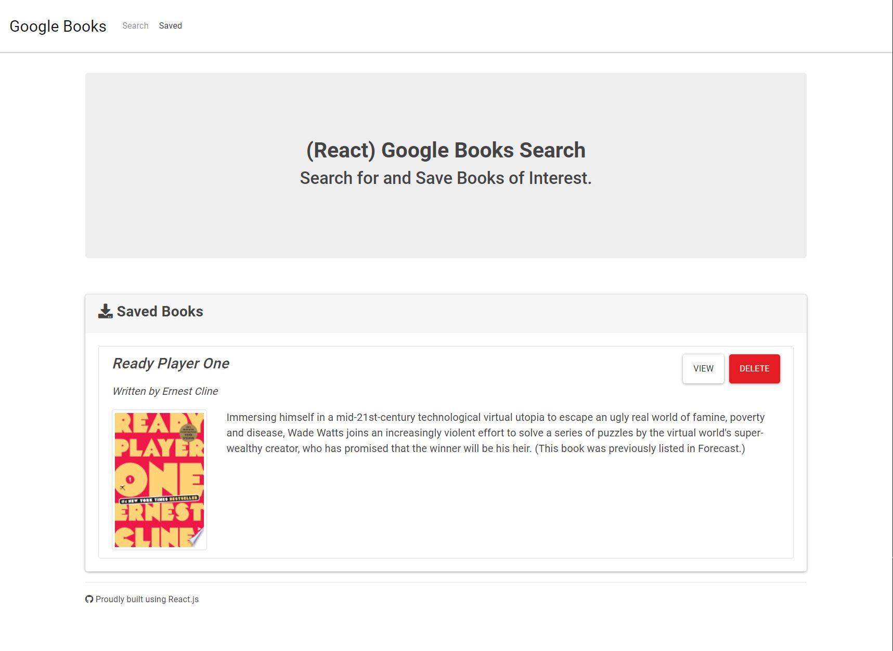

# Google-Books-Search


## Table of Contents

* [Description](#Description)
* [Installation](#Installation)
* [Screenshots](#Screenshots)
* [Tests](#Tests)
* [License](#License)
* [Questions](#Questions)

## Description

This app allows users to search and save books utilizing React and the Google Books API.   

Live app: https://radiant-temple-16140.herokuapp.com/


## Installation
1. Clone the repo
```sh
git@github.com:nartexyu/Google-Books-Search.git
```

2. Install NPM packages
```sh
npm install
```

## Screenshot




## Tests

Test your library
```sh
npm test
```

## License

This repository is not covered under any license. 

## Questions
Please contact with any questions or thoughts.

Email: nathanielyu917@gmail.com
Github: nartexyu
